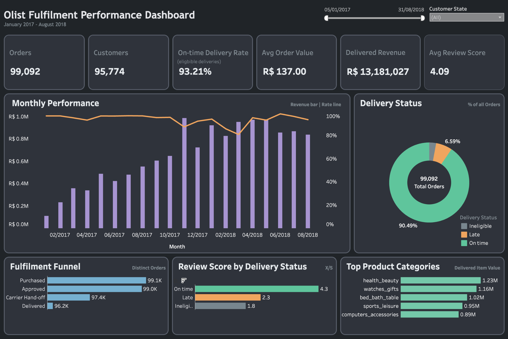

# Joe Tadpatrikar

### Data Analyst | Business Intelligence | Insight & Commercial Analysis

I use SQL and Tableau to turn complex datasets into clear insights, dashboards and recommendations that support better business decisions.

I am interested in roles across data analysis, business intelligence, commercial analysis and insight generation.

[LinkedIn](https://www.linkedin.com/in/joe-tadpatrikar/) · [GitHub](https://github.com/jmtadpatrikar) · [Tableau Public](https://public.tableau.com/app/profile/joe.tadpatrikar)

---

## Featured dashboard

  

Olist fulfilment analysis using MySQL and Tableau to identify delivery bottlenecks and examine the relationship between fulfilment performance and customer reviews.

[Open the dashboard](https://public.tableau.com/app/profile/joe.tadpatrikar/viz/OlistFulfilmentPerformanceDashboard/Dashboard2) · [Read the repository](https://github.com/jmtadpatrikar/Fulfilment-Performance-Analysis-Portfolio-Project)

## Projects

| Project | Skills | Focus |
|---|---|---|
| [Olist Fulfilment Performance Analysis](https://github.com/jmtadpatrikar/Fulfilment-Performance-Analysis-Portfolio-Project) | MySQL · data cleaning · joins · CTEs · window functions · Tableau | Identified fulfilment bottlenecks and examined the relationship between delivery delays and customer reviews. [Dashboard](https://public.tableau.com/app/profile/joe.tadpatrikar/viz/OlistFulfilmentPerformanceDashboard/Dashboard2) |
| [Retail Sales Analysis](https://github.com/jmtadpatrikar/retail-sales-SQL-Tableau-portfolio) | MySQL · data cleaning · SQL views · aggregations · Tableau | Investigated revenue drivers across time periods, product categories and customer types. [Dashboard](https://public.tableau.com/views/retail_sales_dashboard_17864661943300/RetailSalesPerformanceDashboard?:language=en-GB&:display_count=n&:origin=viz_share_link) |
| [COVID-19 Exploratory Data Analysis](https://github.com/jmtadpatrikar/Covid-19-Portfolio-Project) | MySQL · exploratory analysis · CTEs · views · window functions · Tableau | Compared reported cases, deaths, infection rates and vaccination progress across locations. [Dashboard](https://public.tableau.com/shared/R2X565H5M?:display_count=n&:origin=viz_share_link) |

## Core capabilities

**Data analysis:** Data cleaning, exploratory analysis, KPI development, trend analysis and data validation

**Business intelligence:** MySQL, joins, aggregations, common table expressions, window functions, views and Tableau dashboards

**Insight generation:** Identifying performance drivers, comparing segments, interpreting trends and making practical recommendations

**Communication:** Presenting findings clearly through dashboards, concise summaries and business-focused conclusions

## Explore the projects

Each repository contains the detailed business question, dataset, SQL workflow, analytical approach, findings, recommendations and reproduction instructions.

## Contact

- [LinkedIn](https://www.linkedin.com/in/joe-tadpatrikar/)
- [GitHub](https://github.com/jmtadpatrikar)
